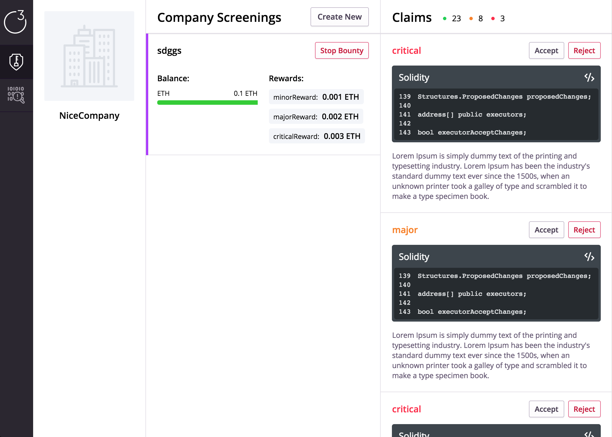
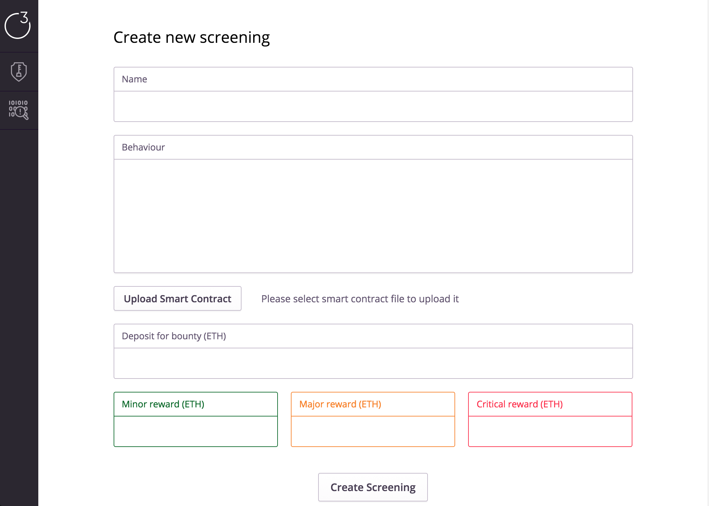
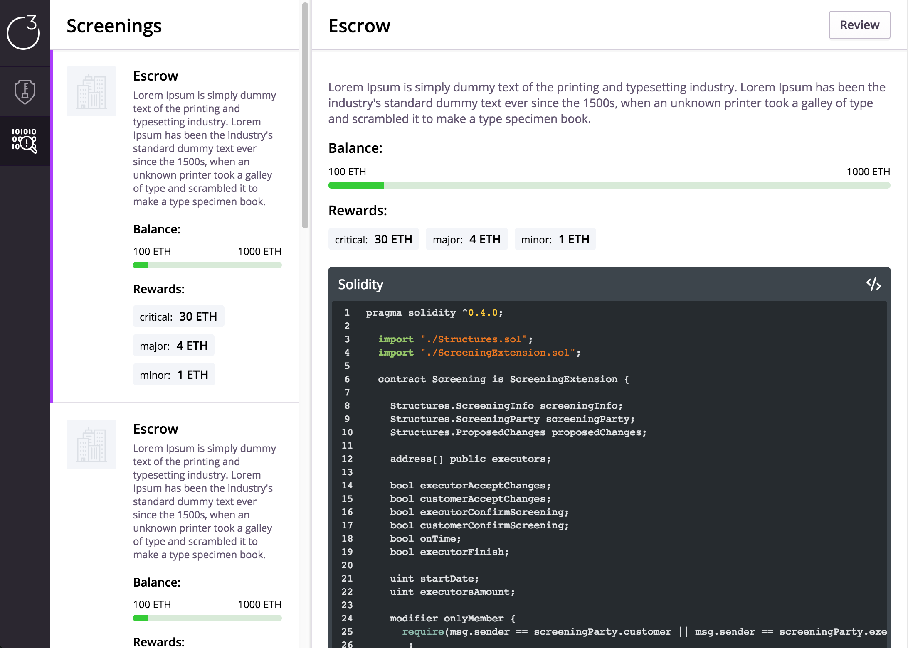
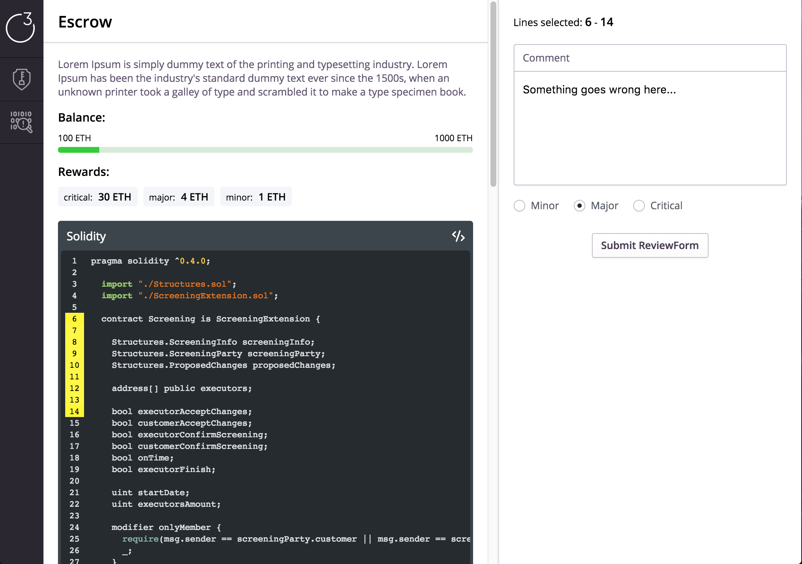

<p align="center">
  
</p>

## Answer the questions

### Summary of the project and the problem you are solving

A p2p platform to review smart contracts, where anyone can bring their contract for a comprehensive quality review with blockchain developers. We help developers and stakeholders confirm the quality and security of their smart contracts in a transparent, affordable way. 
#### Brief background on the team and how you came up with the idea

Most of us met on Blockchainhack 2017, and we met Alex in the Bus.
 
During the audit of the smart contract market researched, we noticed that basically 4 big companies are engaged in this (Zeppelin solutions, New Alchemy, Bok consulting, Pty). But their prices are high and inaccessible to many.
In addition, there is no guarantee that after their audit no bugs will be found (this is proved by the history of the HKG token reissue). These solutions however have huge disadvantages:
 
 - You have to transfer your deposits to company accounts
 - You always pay! it doesn't matter on whether the bugs are found or not
 - The price is too high 
 
We decided that this service can be massively improved thanks to a reputation system, blockchain and smart contracts, so that:
 
 - Block chain developers would receive additional revenue for work
 - Contractor can find more customer, and for cheaper
 - The system trust is maximized
 - The centralization of power issue will be solved
 
 
## Background

| Name | Role | Background | 
| ---- | ---- | ---------- |
| Ivanov Pavel | Front-end / solidity developer | Over 7 years of exp in Front-End Development, ex CoFounder of Leading Online journalism startup, 1-st place IcoLab Hackaton, 2-nd place LAToken hackaton, 3-rd place Blockchainhack 2017 |
| Shevchenko Alexander | Full-stack developer | Finalist Imagine cup Microsoft Canada 2017, founder of SafeWatch, mainly works with computer vision and image analysis|
| Kaizer Denis | Back-end / solidity developer | Developing an trading bot for crypto invest fund, Developing an Asset management platform for crypto market, Master Degree in Math, HSE, 1-st place IcoLab Hackaton, 3-rd place Blockchainhack 2017 |
| Manzyuk Vladimir | System/ Business analyst | System Analyst with 8 years of experience, ex CoFounder of multi media startup tvevt.com, 2-nd place LAToken hackaton, 3-rd place Blockchainhack 2017 |


## What tool(s) / platform(s) do you use?

 
| Entity | Technologies |
| ---- | ---- |
| Smart contract | [Solidity](https://github.com/ForsetiTeam/SmartContracts) |
| Front-end | [React.js + Redux + Metamask](https://github.com/ForsetiTeam/ForsetiTeam) |
| Back-end | [Storj API + Mango DB + node.js backend](https://github.com/ForsetiTeam/Blockjudje_Telegram-bot) |
| Blockchain | [Ethereum](https://github.com/ForsetiTeam/qtumRealisation) |

# Front-End

[site](http://)

### Experience

Pavel Ivanov: *It was an excellent experience of getting acquainted with the technologies of managing crypto-currencies. I met Ethereum, Ktum, Metamask, Pari, Ropsten. Sometimes I had a headache about how it works, especially when I recieved hash sum from service and needed to encode it to array and then convert from bytes and then to associative array with :D I like such brain#*

### Project

#### Techniques

- Universal architecture
  - code shared across platforms (browser, server)
  - universal data fetching
- Functional works (immutability)
- Advanced performance with pure components
- Well tuned dev stack

#### Architecture

- `bin` - compiling and serve files
- `client` - client files
- `config` - settings
- `local_modules` - additional modules
  - *`sb-web3`* - *util / wrapper for web3*
- `shared` - universal files
  - `components` - reusable components or partials
  - `containers` - Root, App, Providers, etc
  - `layouts` - mark up layouts - wrappers for pages (check routes)
  - `pages` - pages are leafs in routes
  - `helpers` - util / helpers
    - `contracts` - ETH Contracts
  - `redux`
    - `actions` - Redux actions
    - `core` - setup Redux
    - `reducers` - Redux [Redaction] reducers
  - `routes`
- `webpack`

### Getting Started

#### Setup

```
git clone https://github.com/ThirdEyeTeam/site.git
cd ./site
npm start
```

#### Tasks

```
npm run <task>
```

* `clean` - remove compile files
* `dev` - start server in development mode (via nodemon)
* `build` - assembly files for client in *production* mode and deploy them to surge.sh


### Screenshots

<p>
  
</p>

<p>
  
</p>

<p>
  
</p>

<p>
  
</p>

<p>
  
</p>
